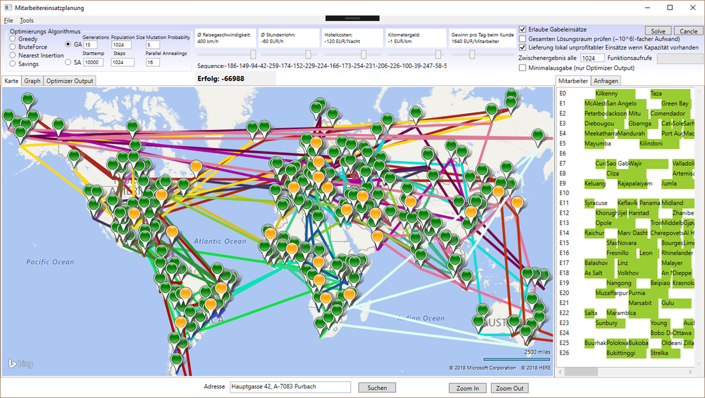

# BusinessTravelOptimizer

The Business-Travel-Optimizer (Mitarbeitereinsatzplanung - MEP) is an operations-research-tool that allows the user to model and optimize the assignment of engineers to customer-engagements.

The software is designed to minimize the number of hours consultants spend in airplanes, trains, cars and hotel rooms away from their family and friends.

Empirical simulations show that the proposed optimizations have the potential to increase the profit of an average international consulting-company by more than 40% while at the same time reducing the travel-related CO²-emission by more than 30% (compared to a naive greedy dispatching strategy).

Since climate change is a major global challenge i decided to open source this software that was part of my bachelor thesis.

The software may also be used to simulate global events (like Brexit) and their economical impact. (For example one could change the cost function to incorporate political decisions and simulate their impact on unemployment-rates and income.)

It is free to use on your own risk.

<h1>Installation Instructions</h1>

<ul>
<li>Clone the mroject to your local machine </li>
<li>
The project got created with visual studio 2015 professional edition. I guess it should also work with community edition but never tested that.
</li>
<li>
Make sure you install the Bing-Maps-WPF Control first: https://www.microsoft.com/en-us/download/details.aspx?id=27165</li>
<li>
You also need a Bing-Maps-API-Key: 
https://docs.microsoft.com/en-us/bingmaps/getting-started/bing-maps-dev-center-help/getting-a-bing-maps-key  
It has to be entered in the settings1.settings file in the Geocoding-project. (And maybe also in the app.config file in the Geocoding Project)</li>
</ul>

Compile it! (There is no compiled version available on the internet, so you need to build it on your own machine atm.)
